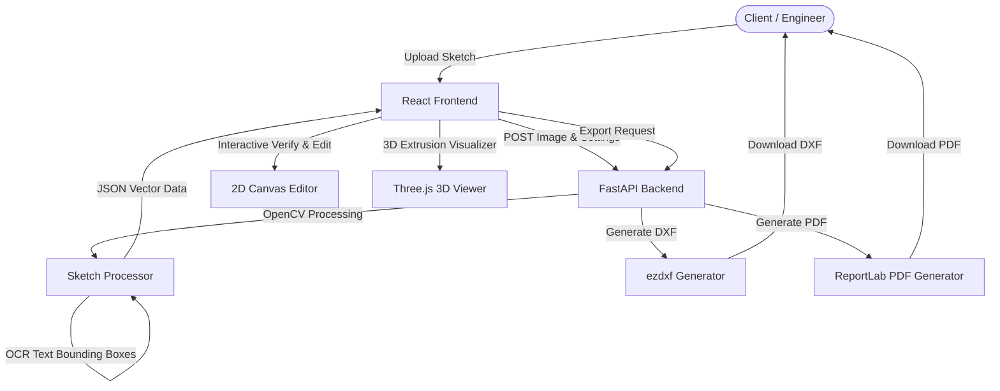

# AI Sketch to AutoCAD - Implementation Plan

This project implements a complete pipeline to convert hand-drawn paper sketches into professional vector CAD drawings (DXF), high-quality vector PDFs, and 3D architectural extrusions.

## System Architecture Overview



---

## User Review Required

> [!IMPORTANT]
> **Environment Context & Node/NPM Availability**
> Node/NPM is not installed/configured in the current environment path. To ensure the React frontend runs flawlessly without requiring manual environment installations, we will use a **unified FastAPI structure** that serves the frontend files statically. We will write the frontend using **React 18** and **Babel Standalone** loaded via CDNs, allowing us to write modern, clean JSX components in separate files (e.g., `app.jsx`) that require no pre-compilation step.

> [!WARNING]
> **AI/OCR Weight & Fallback Strategy**
> Installing PyTorch and heavy deep-learning frameworks like YOLO or EasyOCR can take up to 2GB of disk space and download time, and might perform slowly without a GPU.
> - **Our Approach**: We will implement a highly optimized, deterministic **OpenCV Sketch Processor** using Gaussian/Bilateral filtering, Adaptive Thresholding, and Progressive Probabilistic Hough Transform (`HoughLinesP`) to extract walls and align lines to a layout grid.
> - **OCR & Text fallback**: We will use a geometric text detector / contour bounding box parser for text, and integrate a robust mock-OCR engine that highlights text areas. If the user installs `easyocr`, the backend will dynamically import it and run it; otherwise, it will gracefully fall back to highlighting detected labels, letting the engineer quickly type in the correct dimensions in the interactive UI during the **Engineer Verify** phase.

> [!TIP]
> **Interactive "Engineer Verify" Visualizer**
> Sketch-to-CAD engines are rarely 100% accurate due to hand-drawn variations. To make this tool production-ready, our frontend will include an **interactive 2D CAD canvas** (SVG/HTML5 Canvas) where engineers can:
> 1. Click-and-drag lines to adjust coordinates.
> 2. Snap lines to horizontal, vertical, or angle alignments.
> 3. Click text boxes to type/correct parsed dimensions.
> 4. Add/delete lines, doors, and windows.
> 5. View a **Three.js 3D window** that extrudes the 2D plan in real-time.

---

## Open Questions

1. **CAD Drawing Scale**: What default scale should we assume (e.g. 100 pixels = 1 meter, or 100 pixels = 10 feet)? We plan to make this adjustable in the UI sidebar.
2. **CAD Layers**: Do you have preferred layers or layer colors for DXF output? We will use a standard color scheme (e.g., `WALLS` = white, `DOORS` = orange, `WINDOWS` = blue, `DIMENSIONS` = green).

---

## Proposed Changes

### Backend Component (FastAPI & Python)

We will create a structured backend layout inside `d:/civil_antigravity/backend`.

#### [NEW] [requirements.txt](file:///d:/civil_antigravity/backend/requirements.txt)
Defines python requirements:
```txt
fastapi
uvicorn
python-multipart
opencv-python
numpy
ezdxf
reportlab
```

#### [NEW] [main.py](file:///d:/civil_antigravity/backend/main.py)
Sets up the FastAPI application, endpoints, and serving of static files.
- `POST /api/process`: Takes image + threshold/grid-snap parameters, returns detected lines/texts.
- `POST /api/export/dxf`: Takes the verified coordinate list and generates/streams a `.dxf` file.
- `POST /api/export/pdf`: Takes the verified coordinate list and generates/streams a `.pdf` file.
- `GET /`: Serves the React single-page frontend.

#### [NEW] [processor.py](file:///d:/civil_antigravity/backend/processor.py)
Implements OpenCV drawing-to-vector algorithm:
1. Bilateral filtering for denoising.
2. Adaptive thresholding & Morphological closing to thicken wall sketch lines.
3. Hough Line Transform (`HoughLinesP`) to find line segments.
4. Line clustering & merge logic (combining close collinear segments).
5. Grid snapping (rounding segments to horizontal/vertical within a tolerance).
6. Corner detection & Room contour parsing.
7. Text contour extraction to identify written dimensions.

#### [NEW] [dxf_generator.py](file:///d:/civil_antigravity/backend/dxf_generator.py)
Uses `ezdxf` to create standard R12/2000 DXF files:
- Creates layers: `WALLS`, `DOORS`, `WINDOWS`, `DIMENSIONS`.
- Adds linear segments, texts, and block representations for doors (arcs/lines).

#### [NEW] [pdf_generator.py](file:///d:/civil_antigravity/backend/pdf_generator.py)
Uses `reportlab` to render a high-quality, scalable vector PDF of the floor plan complete with a standard drawing title block.

---

### Frontend Component (React SPA)

We will place static files in `d:/civil_antigravity/frontend/static`.

#### [NEW] [index.html](file:///d:/civil_antigravity/frontend/static/index.html)
Main page containing style hooks, loading script CDNs (React, Babel, Tailwind CSS for modern aesthetics, Three.js, Lucide Icons), and mounting the root component.

#### [NEW] [app.jsx](file:///d:/civil_antigravity/frontend/static/app.jsx)
React app containing state and UI sections:
- **Header**: Title, server status, and workflow step indicator.
- **Controls Sidebar**: Upload controls, processing parameters (thresholds, grid snapping), drawing scale, export buttons.
- **Main Canvas Panel**: 
  - Tab 1: **Upload & Detected Overlay** (Original sketch + OpenCV overlays).
  - Tab 2: **Interactive 2D Editor (Engineer Verify)** (Click-to-adjust, snap-to-grid, delete/add wall/door/window tools, edit dimensions).
  - Tab 3: **3D Extrusion View** (Three.js orbit viewer).
- **Console / Status Log**: Displays processing outputs, dimensions list.

#### [NEW] [styles.css](file:///d:/civil_antigravity/frontend/static/styles.css)
Sleek glassmorphism style rules, neon accent outlines, and animations to give a premium, state-of-the-art engineering dashboard aesthetic.

---

## Verification Plan

### Automated Tests
- We will write a lightweight test script `backend/test_processor.py` that verifies image load, line detection, and DXF/PDF generation using a mock sketch pattern (generated programmatically) to ensure the backend is fully operational without requiring physical sketch uploads.
- Run test:
  ```powershell
  python backend/test_processor.py
  ```

### Manual Verification
1. Launch the FastAPI server:
   ```powershell
   python -m uvicorn backend.main:app --reload --port 8000
   ```
2. Open browser at `http://localhost:8000`.
3. Upload a sample architectural sketch.
4. Modify settings (e.g., adaptive threshold, grid-snap) and check processing updates.
5. In the 2D Canvas, verify:
   - Lines can be selected, moved, and snapped.
   - Text dimension values can be edited.
6. Check the 3D extrusion model (rotate, zoom, inspect extruded walls).
7. Download DXF and PDF and inspect their files.
